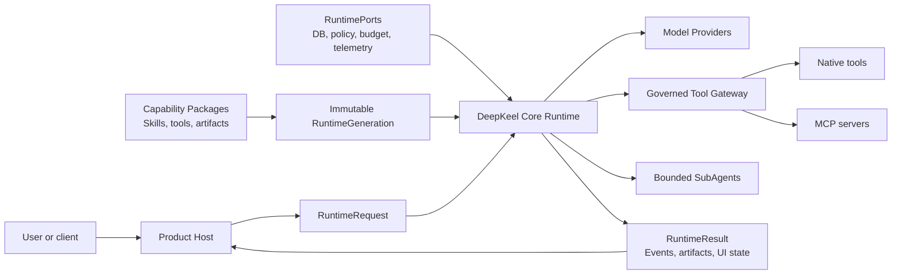
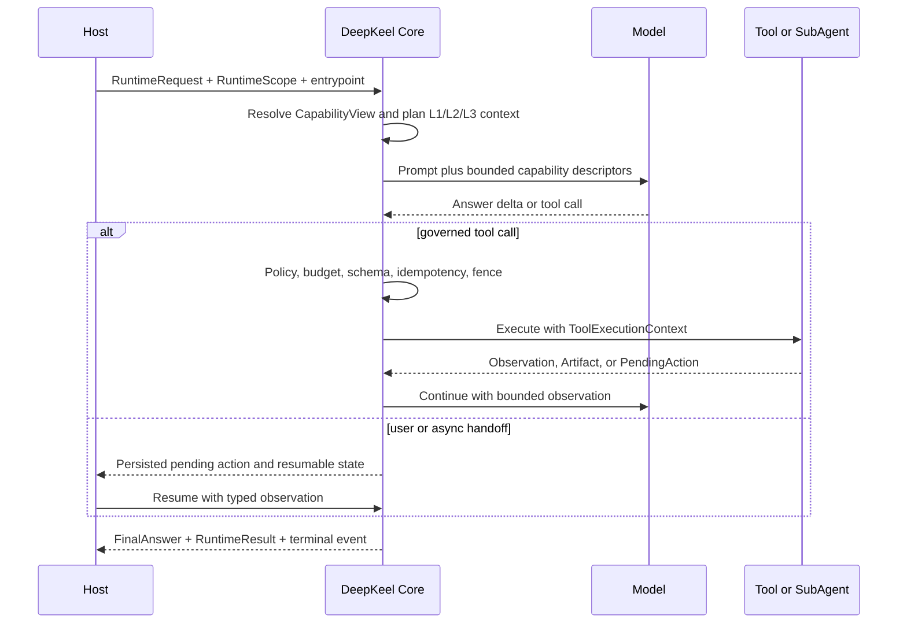

# DeepKeel

[English](README.md) | [简体中文](README.zh-CN.md)

[](https://github.com/bufeibufei/deepkeel/actions/workflows/ci.yml)
[](https://github.com/bufeibufei/deepkeel/actions/workflows/full-regression.yml)
[](https://www.python.org/)
[](LICENSE)

**A durable, governed Harness Agent runtime for building long-running agent
systems from reusable Capability Packages.**

DeepKeel provides the execution kernel between a product Host and domain
capabilities. It runs one canonical model/tool loop, narrows the capabilities
visible to each conversation, survives interruptions, and projects typed events,
artifacts, diagnostics, and UI state. The same runtime can power a general root
agent and directly addressable specialist agents without duplicating the loop.

DeepKeel is not a chatbot UI, a model gateway, or a collection of business
prompts. Your Host owns transport, identity, databases, credentials, queues, and
UX. Capability Packages own domain Skills, tools, artifacts, and handoffs.

[Quickstart](#60-second-quickstart) · [Architecture](#architecture) ·
[Why DeepKeel](#why-deepkeel) · [Kuitianjiandi case study](docs/case-study-kuitianjiandi.md) ·
[Documentation](#documentation)

## Why DeepKeel

Agent demos are easy to build. Product runtimes become difficult when they must
recover after a process crash, prevent a stale worker from committing a result,
keep hundreds of tools out of the prompt, resume a user handoff, and explain why
a model or tool was selected.

DeepKeel turns those concerns into runtime contracts instead of product-specific
conditionals:

| Product problem | DeepKeel mechanism | Verifiable evidence |
| --- | --- | --- |
| Long work is interrupted or moved to another worker | Canonical run state, portable checkpoints, graph checkpoints, leases, and fencing | [Durable execution](docs/durable-execution.md) |
| Skill and tool catalogs outgrow the model context | Permission-first discovery, progressive disclosure, bounded retrieval and reranking | [Catalog discovery](docs/catalog-discovery.md) |
| Different assistants need different capabilities | Versioned agent entrypoints and immutable per-conversation `CapabilityView` | [Agent entrypoints](docs/agent-entrypoints.md) |
| Tool retries can repeat side effects | Idempotent claims, execution settlement, and execution fences | [Production readiness](docs/production-readiness.md) |
| Frontends guess run state from prose | Typed events, artifacts, pending actions, and stable `ui_state` projection | [Runtime lifecycle](docs/runtime-lifecycle.md) |
| Framework code becomes coupled to one product | Stable Runtime, Extension, Adapter, Discovery, Memory, MCP, and Orchestration SDKs | [Architecture](docs/architecture.md) |
| A release passes locally but fails in a Host | Clean-wheel conformance, Host compatibility, PostgreSQL, concurrency, and fault-injection gates | [Verification matrix](docs/verification-matrix.md) |

## 60-second quickstart

The repository includes a deterministic local provider, so the first run needs
no API key and makes no network request.

```bash
git clone https://github.com/bufeibufei/deepkeel.git
cd deepkeel
python -m venv .venv
```

```bash
# Windows PowerShell
.venv\Scripts\Activate.ps1
pip install -e .
python examples/quickstart/main.py
```

```bash
# macOS / Linux
source .venv/bin/activate
pip install -e .
python examples/quickstart/main.py
```

Expected output:

```text
DeepKeel received: Is the runtime ready?
```

The Golden Path uses the same runtime as production composition:

```python
from deepkeel.runtime_sdk import AgentHarness


class LocalProvider:
    model = "quickstart-model"
    model_role = "fast"

    def complete_chat(self, messages, **_kwargs):
        question = str(messages[-1].get("content") or "")
        return {
            "message": {
                "role": "assistant",
                "content": f"DeepKeel received: {question}",
            },
            "finish_reason": "stop",
            "model": self.model,
        }


harness = AgentHarness.create(provider=LocalProvider())
result = harness.run("Is the runtime ready?", user_id="quickstart-user")
print(result.final_answer.markdown)
```

Install the stable `4.1.0` package directly from its immutable tag when embedding
DeepKeel in another repository:

```bash
pip install "deepkeel @ git+https://github.com/bufeibufei/deepkeel.git@v4.1.0"
```

For a production Host, compose explicit durable `RuntimePorts` and call
`HarnessRuntimeBuilder(profile="production").build_production()`. Use `arun()`
for request/response and `astream()` for live event delivery.

## Architecture



The boundary is deliberate:

| Layer | Owns | Does not own |
| --- | --- | --- |
| **Host** | HTTP/SSE, auth, tenants, queues, durable infrastructure, model credentials, product policy, UI | Agent-loop semantics or domain package internals |
| **DeepKeel Core** | ReAct lifecycle, context planning, model/tool execution, interruption, recovery, policy/budget gates, events, artifacts, diagnostics | Product routes, ORM models, business prompts, or pages |
| **Capability Package** | Domain Skills, tools, artifact schemas, handoffs, context contributors, MCP and specialist definitions | Host credentials, transport, private Core state, or unrestricted infrastructure |

LangGraph is the built-in internal execution engine for checkpoint-aware graph
control flow. DeepKeel keeps it behind `TurnExecutionEngine`; neither the Host nor
a Capability Package imports LangGraph state or command types. See
[Design decisions](docs/design-decisions.md) for the rationale and tradeoffs.

## One run, end to end



The event envelope is the fact. SSE messages, OpenTelemetry spans, compact trace
rows, and frontend state are projections of the same ordered runtime events. A
resume restores persisted state and observations; it does not infer progress from
assistant prose.

## Core capabilities

- **One canonical loop:** synchronous `run()`, asynchronous `arun()`, and
  streaming `astream()` share one async state machine.
- **Durable lifecycle:** interruption, user confirmation, asynchronous work,
  cancellation, resume, lease takeover, and terminal settlement use typed state.
- **Governed execution:** policy, budget, health, guardrails, sandbox, workspace,
  secrets, idempotency, and fencing are explicit Ports or contracts.
- **Capability scale:** agent entrypoints, hybrid Skill/Tool discovery, progressive
  disclosure, and immutable runtime generations bound what the model can see.
- **Context engineering:** L1 current context, L2 working checkpoints, and L3
  durable recall are token-aware and source-linked.
- **Structured product output:** `Observation`, `Artifact`, `PendingAction`,
  references, `FinalAnswer`, and `RuntimeUIState` replace UI parsing of prose.
- **Interoperability:** native tools and MCP share the governed tool gateway;
  bounded SubAgents and optional A2A adapters remain parent-controlled.
- **Operations:** run inspection, cancellation, recovery commands, typed failure
  diagnosis, OpenTelemetry projection, and deterministic evaluation contracts.

## Capability Packages

A Capability Package is the unit of domain reuse. Its manifest declares identity,
version, dependencies, permissions, tools, Skills, artifacts, budgets, and
entrypoints. `install(CapabilityInstallContext)` contributes implementations to a
new immutable `RuntimeGeneration`; it cannot reach into Host ORM objects or
private runtime state.

Start with the runnable [inventory package](examples/inventory_pack), then use:

```bash
deepkeel pack init ./my_package --package-id com.example.inventory
deepkeel pack validate ./my_package/manifest.json
```

Production packages should follow the Manifest-first
[Capability Package V1 contract](docs/capability-package-v1.md). Package install,
enable, disable, upgrade, and rollback create new generations; existing runs keep
the generation they started with. The code-level `CapabilityPackSpec` and the
persisted manifest are validated as one contribution contract.

## Proven in a real Host

DeepKeel was extracted from **Kuitianjiandi**, a conversational application where
one root agent coordinates deterministic domain tools, retrieval, long-running
report generation, user handoffs, specialist agents, and mobile artifact views.
That Host exercises the boundaries that small examples usually skip:

- synchronous chat and SSE streaming use the same run identity;
- long-running Bazi and Liuyao workflows suspend and resume across workers;
- domain results are returned as typed artifacts rather than embedded UI markup;
- a large capability catalog is narrowed by entrypoint, policy, Skill, and
  progressive disclosure;
- PostgreSQL, OpenTelemetry, Tempo, Loki, Prometheus, and Grafana provide durable
  state and operational diagnostics outside Core.

Read the sanitized [Kuitianjiandi case study](docs/case-study-kuitianjiandi.md) for
the concrete mapping from product failures to runtime contracts.

## Public SDK map

| SDK | Use it for |
| --- | --- |
| `deepkeel.runtime_sdk` | Requests, results, run state, events, execution, inspection, cancellation, and recovery |
| `deepkeel.extension_sdk` | Capability Packages, Skills, tools, artifacts, handoffs, hooks, and trust |
| `deepkeel.adapter_sdk` | Host Ports, model/provider certification, composition, and conformance suites |
| `deepkeel.discovery_sdk` | Provider-neutral hybrid Skill and Tool retrieval/reranking |
| `deepkeel.memory_sdk` | Product-neutral memory records, recall policy, and storage Ports |
| `deepkeel.mcp_sdk` | Governed MCP client, transports, discovery, and tool projection |
| `deepkeel.orchestration_sdk` | Bounded plans, SubAgents, and deliberation contracts |
| `deepkeel.a2a_sdk` | Experimental A2A remote-specialist interoperability |

The stable public SDK is `4.1.0`; the persisted Capability Package contract is
`harness-core-v3`. Public symbols are frozen in `deepkeel.public_api` and checked
by an API fingerprint gate.

## Examples

| Example | What it proves |
| --- | --- |
| [quickstart](examples/quickstart) | Offline Golden Path with a deterministic provider |
| [inventory_pack](examples/inventory_pack) | Product-neutral Capability Package and governed tool |
| [durable_approval](examples/durable_approval) | Typed interruption, approval, and resume |
| [production_worker](examples/production_worker) | Production profile, PostgreSQL Ports, migrations, and optional OTel |
| [reference_host](examples/reference_host) | HTTP, SSE, run inspection, and cancellation outside Core |

## Verification and release evidence

DeepKeel does not treat a unit-test pass as production proof. Its release path
separates fast pull-request checks from full and release-only gates:

- Ruff, mypy, type-debt, API-fingerprint, import-cycle, and structural ratchets;
- deterministic runtime tests with an 80% package coverage floor;
- adapter conformance and PostgreSQL coverage, migration, and multi-worker tests;
- fault injection for checkpoint authority, rollback, recovery, and cancellation;
- a deterministic 300-request / 32-worker Core concurrency baseline;
- clean wheel and sdist installation, Host compatibility, SBOM, checksums, and
  build provenance.

See the [verification matrix](docs/verification-matrix.md) for commands, owning
workflows, and the guarantee each gate is intended to protect.

```powershell
uv sync --extra test
uv run ruff check src tests verification examples
uv run mypy src/deepkeel
uv run pytest -q --cov=deepkeel --cov-fail-under=80
```

Run the complete local release verifier with:

```powershell
.\scripts\verify.ps1
```

## Documentation

**Understand the runtime**

- [Architecture](docs/architecture.md)
- [Runtime lifecycle](docs/runtime-lifecycle.md)
- [Durable execution](docs/durable-execution.md)
- [Context management](docs/context-management.md)
- [Design decisions](docs/design-decisions.md)

**Extend the runtime**

- [Capability Package V1](docs/capability-package-v1.md)
- [Agent entrypoints](docs/agent-entrypoints.md)
- [Catalog discovery](docs/catalog-discovery.md)
- [Model providers](docs/model-provider.md)
- [MCP and A2A interoperability](docs/interoperability.md)

**Operate and release**

- [Production readiness](docs/production-readiness.md)
- [PostgreSQL reference](docs/postgresql-reference.md)
- [Observability](docs/observability.md)
- [Security and trust](docs/security-and-trust.md)
- [Capability trust](docs/capability-trust.md)
- [Supply-chain controls](docs/supply-chain.md)
- [Release process](docs/releasing.md)
- [Host compatibility](docs/host-compatibility.md)

**Compatibility**

- [API stability](docs/api-stability.md)
- [Migrating to 4.1](docs/migrating-to-4.1.md)
- [Execution planning](docs/execution-planning.md)

## Project status

DeepKeel `4.1.0` exposes a stable typed SDK and a production profile with
executable readiness checks. The bundled `InMemory*` adapters remain intentionally
limited to tests and single-process development. A production deployment must
provide durable Host infrastructure and pass the relevant conformance suites.

Design questions belong in GitHub Discussions; reproducible defects belong in
[Issues](https://github.com/bufeibufei/deepkeel/issues). See
[CONTRIBUTING.md](CONTRIBUTING.md), [SECURITY.md](SECURITY.md),
[SUPPORT.md](SUPPORT.md), and [CHANGELOG.md](CHANGELOG.md).

DeepKeel is licensed under the [Apache License 2.0](LICENSE).
