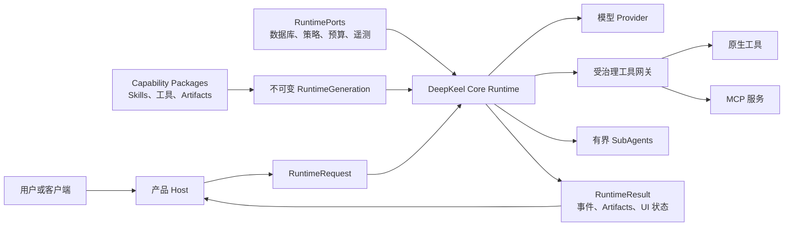
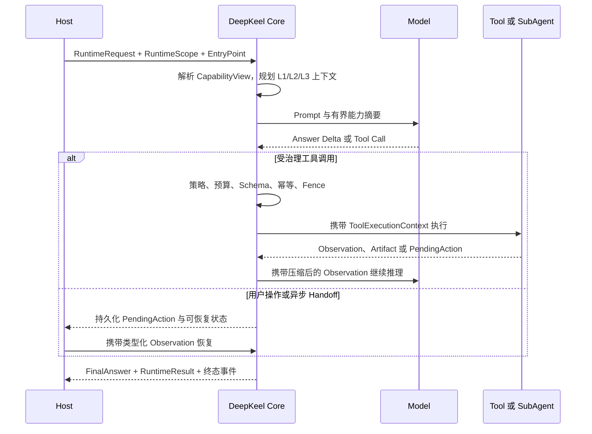

# DeepKeel

[English](README.md) | [简体中文](README.zh-CN.md)

[](https://github.com/bufeibufei/deepkeel/actions/workflows/ci.yml)
[](https://github.com/bufeibufei/deepkeel/actions/workflows/full-regression.yml)
[](https://www.python.org/)
[](LICENSE)

**用可复用 Capability Package 构建长期运行 Agent 系统的持久化、受治理 Harness
Agent Runtime。**

DeepKeel 位于产品 Host 与领域能力之间，提供统一的执行内核。它运行一套规范的
模型/工具循环，为每个会话收窄可见能力，在中断后可靠恢复，并向外投影类型化事件、
Artifact、诊断和 UI 状态。同一 Runtime 可以同时支撑通用主 Agent 与可直接访问的
专家 Agent，而不复制第二套循环。

DeepKeel 不是聊天页面、模型网关或业务提示词集合。Host 负责传输、身份、数据库、
密钥、队列和用户体验；Capability Package 负责领域 Skill、工具、Artifact 与 Handoff。

[快速开始](#60-秒快速开始) · [整体架构](#整体架构) ·
[为什么需要-deepkeel](#为什么需要-deepkeel) · [文档导航](#文档导航)

## 为什么需要 DeepKeel

做出一个 Agent Demo 并不困难。真正进入产品后，系统需要处理进程崩溃后的恢复、
旧 Worker 越权提交、能力目录膨胀、用户操作挂起、工具副作用去重，以及“为什么选择
这个模型或工具”的可解释诊断。

DeepKeel 将这些问题收敛成 Runtime 契约，而不是散落在业务代码里的条件分支：

| 产品问题 | DeepKeel 机制 | 可验证依据 |
| --- | --- | --- |
| 长任务中断或迁移到其他 Worker | Canonical State、Portable Checkpoint、Graph Checkpoint、Lease 与 Fencing | [持久化执行](docs/durable-execution.zh-CN.md) |
| Skill 和工具数量撑大模型上下文 | 权限优先发现、渐进式披露、有界召回与重排 | [能力目录发现](docs/catalog-discovery.zh-CN.md) |
| 不同 Agent 需要不同能力范围 | 版本化 Agent EntryPoint 与会话级不可变 `CapabilityView` | [Agent 入口](docs/agent-entrypoints.zh-CN.md) |
| 工具重试可能重复产生副作用 | 幂等 Claim、执行结算与 Execution Fence | [生产就绪](docs/production-readiness.zh-CN.md) |
| 前端只能从文本猜测任务状态 | 类型化事件、Artifact、PendingAction 与稳定 `ui_state` 投影 | [运行生命周期](docs/runtime-lifecycle.zh-CN.md) |
| 框架与单一业务深度耦合 | Runtime、Extension、Adapter、Discovery、Memory、MCP、Orchestration SDK | [整体架构](docs/architecture.zh-CN.md) |
| 本地通过但接入 Host 后失败 | 候选 Wheel、Host 兼容、PostgreSQL、并发与故障注入门禁 | [验证矩阵](docs/verification-matrix.zh-CN.md) |

## 60 秒快速开始

仓库内置确定性的本地 Provider，第一次运行不需要 API Key，也不会发起网络请求。

```bash
git clone https://github.com/bufeibufei/deepkeel.git
cd deepkeel
python -m venv .venv
```

```bash
# Windows PowerShell
.venv\Scripts\Activate.ps1
pip install -e .
python examples/quickstart/main.py
```

```bash
# macOS / Linux
source .venv/bin/activate
pip install -e .
python examples/quickstart/main.py
```

预期输出：

```text
DeepKeel received: Is the runtime ready?
```

Golden Path 与生产装配使用的是同一套 Runtime：

```python
from deepkeel.runtime_sdk import AgentHarness


class LocalProvider:
    model = "quickstart-model"
    model_role = "fast"

    def complete_chat(self, messages, **_kwargs):
        question = str(messages[-1].get("content") or "")
        return {
            "message": {
                "role": "assistant",
                "content": f"DeepKeel received: {question}",
            },
            "finish_reason": "stop",
            "model": self.model,
        }


harness = AgentHarness.create(provider=LocalProvider())
result = harness.run("Is the runtime ready?", user_id="quickstart-user")
print(result.final_answer.markdown)
```

在其他仓库中接入时，可直接从不可变标签安装稳定版 `4.1.0`：

```bash
pip install "deepkeel @ git+https://github.com/bufeibufei/deepkeel.git@v4.1.0"
```

生产 Host 应注入持久化 `RuntimePorts`，并通过
`HarnessRuntimeBuilder(profile="production").build_production()` 完成可执行门禁。
请求响应使用 `arun()`，实时事件使用 `astream()`。

## 整体架构



三层边界是有意设计的：

| 层级 | 负责 | 不负责 |
| --- | --- | --- |
| **Host** | HTTP/SSE、认证、租户、队列、持久化基础设施、模型密钥、产品策略、UI | Agent Loop 语义或领域包内部实现 |
| **DeepKeel Core** | ReAct 生命周期、上下文规划、模型/工具执行、中断恢复、策略/预算门禁、事件、Artifact、诊断 | 产品路由、ORM 模型、业务提示词或页面 |
| **Capability Package** | 领域 Skill、工具、Artifact Schema、Handoff、上下文贡献、MCP 与专家定义 | Host 密钥、传输层、Core 私有状态或无限制基础设施访问 |

LangGraph 是内置的 Checkpoint-aware 图执行引擎。DeepKeel 将它封装在
`TurnExecutionEngine` 之后，Host 与 Capability Package 都不依赖 LangGraph 的
State 或 Command 类型。选择原因和代价见[架构决策](docs/design-decisions.zh-CN.md)。

## 一次运行如何完成



有序 Runtime Event Envelope 是事实源。SSE 消息、OpenTelemetry Span、紧凑 Trace
和前端状态都是同一事件流的投影。恢复时读取持久化状态与 Observation，不会从
Assistant 文本猜测执行进度。

## 核心能力

- **一套规范循环：** `run()`、`arun()` 和 `astream()` 共享同一异步状态机。
- **持久化生命周期：** 中断、用户确认、异步任务、取消、恢复、Lease 接管和终态
  结算都使用类型化状态。
- **受治理执行：** 策略、预算、模型健康、Guardrail、Sandbox、Workspace、Secret、
  幂等和 Fencing 都是显式 Port 或契约。
- **大规模能力治理：** Agent EntryPoint、Skill/Tool 混合发现、渐进式披露与不可变
  Runtime Generation 共同约束模型可见范围。
- **上下文工程：** L1 当前上下文、L2 工作检查点、L3 长期召回按 Token 预算规划，
  并保留来源关联。
- **结构化产品输出：** `Observation`、`Artifact`、`PendingAction`、Reference、
  `FinalAnswer` 和 `RuntimeUIState` 避免前端解析自然语言。
- **互操作：** 原生工具与 MCP 共享受治理网关；SubAgent 与可选 A2A 适配仍受父运行
  的权限、预算和取消控制。
- **运行运维：** Run 查询、取消、恢复命令、类型化失败诊断、OTel 投影和确定性评测。

## Capability Package

Capability Package 是领域能力复用单元。Manifest 声明身份、版本、依赖、权限、工具、
Skill、Artifact、预算与 EntryPoint；`install(CapabilityInstallContext)` 将实现贡献到
新的不可变 `RuntimeGeneration`，不能直接访问 Host ORM 或 Core 私有状态。

可以从可运行的 [inventory package](examples/inventory_pack/README.zh-CN.md) 开始：

```bash
deepkeel pack init ./my_package --package-id com.example.inventory
deepkeel pack validate ./my_package/manifest.json
```

生产能力包应遵循 Manifest-first 的
[Capability Package V1 契约](docs/capability-package-v1.zh-CN.md)。安装、启用、禁用、升级、
回滚都会形成新世代；已开始的 Run 继续使用启动时捕获的世代。代码层的
`CapabilityPackSpec` 与持久化 Manifest 会作为同一个贡献契约接受校验。

## 公开 SDK

| SDK | 使用场景 |
| --- | --- |
| `deepkeel.runtime_sdk` | 请求、结果、Run 状态、事件、执行、查询、取消与恢复 |
| `deepkeel.extension_sdk` | Capability Package、Skill、工具、Artifact、Handoff、Hook 与信任策略 |
| `deepkeel.adapter_sdk` | Host Port、模型认证、Runtime 装配与适配器契约测试 |
| `deepkeel.discovery_sdk` | 与 Provider 无关的 Skill/Tool 混合召回与重排 |
| `deepkeel.memory_sdk` | 产品中立的 Memory 记录、召回策略与存储 Port |
| `deepkeel.mcp_sdk` | 受治理的 MCP Client、传输、发现与工具投影 |
| `deepkeel.orchestration_sdk` | 有界 Plan、SubAgent 与多方论证契约 |
| `deepkeel.a2a_sdk` | 实验性的 A2A 远程专家互操作 |

稳定公开 SDK 版本为 `4.1.0`，持久化 Capability Package 契约为
`harness-core-v3`。公开符号冻结在 `deepkeel.public_api`，由 API 指纹门禁保护。

## 示例

| 示例 | 验证内容 |
| --- | --- |
| [quickstart](examples/quickstart/README.zh-CN.md) | 使用确定性 Provider 的离线 Golden Path |
| [inventory_pack](examples/inventory_pack/README.zh-CN.md) | 产品中立 Capability Package 与受治理工具 |
| [durable_approval](examples/durable_approval/README.zh-CN.md) | 类型化中断、审批与恢复 |
| [production_worker](examples/production_worker/README.zh-CN.md) | Production Profile、PostgreSQL Port、迁移与可选 OTel |
| [reference_host](examples/reference_host/README.zh-CN.md) | Core 外部的 HTTP、SSE、Run 查询与取消 |

## 验证与发布证据

DeepKeel 不把“单元测试通过”视为完整生产证明。发布链路将 PR 快速门禁、完整回归
和发布门禁分开执行：

- Ruff、mypy、类型债务、API 指纹、导入环和结构复杂度约束；
- 确定性 Runtime 测试与 80% 包覆盖率下限；
- Adapter Conformance、PostgreSQL 覆盖率、迁移与多 Worker 测试；
- Checkpoint Authority、回滚、恢复与取消的故障注入；
- 300 请求、32 Worker 的确定性 Core 并发基线；
- 干净 Wheel/sdist 安装、Host Compatibility、SBOM、Checksum 与构建来源证明。

[验证矩阵](docs/verification-matrix.zh-CN.md)列出了每个门禁的命令、所属 Workflow 和它要
保护的系统保证。

```powershell
uv sync --extra test
uv run ruff check src tests verification examples
uv run mypy src/deepkeel
uv run pytest -q --cov=deepkeel --cov-fail-under=80
```

本地执行完整发布验证：

```powershell
.\scripts\verify.ps1
```

## 文档导航

下列文档和可运行示例均提供独立简体中文版本；进入任一文档后，可通过顶部语言入口
在英文与中文之间切换。

**理解 Runtime**

- [整体架构](docs/architecture.zh-CN.md)
- [运行生命周期](docs/runtime-lifecycle.zh-CN.md)
- [持久化执行](docs/durable-execution.zh-CN.md)
- [上下文管理](docs/context-management.zh-CN.md)
- [架构决策](docs/design-decisions.zh-CN.md)

**扩展 Runtime**

- [Capability Package V1](docs/capability-package-v1.zh-CN.md)
- [Agent 入口与专家作用域](docs/agent-entrypoints.zh-CN.md)
- [能力目录发现](docs/catalog-discovery.zh-CN.md)
- [模型 Provider](docs/model-provider.zh-CN.md)
- [MCP 与 A2A 互操作](docs/interoperability.zh-CN.md)

**运维与发布**

- [生产就绪](docs/production-readiness.zh-CN.md)
- [PostgreSQL 参考适配](docs/postgresql-reference.zh-CN.md)
- [可观测性](docs/observability.zh-CN.md)
- [安全与信任](docs/security-and-trust.zh-CN.md)
- [Capability Package 信任](docs/capability-trust.zh-CN.md)
- [供应链治理](docs/supply-chain.zh-CN.md)
- [发布流程](docs/releasing.zh-CN.md)
- [下游 Host 兼容门禁](docs/host-compatibility.zh-CN.md)

**兼容性**

- [API 稳定性](docs/api-stability.zh-CN.md)
- [迁移到 4.1](docs/migrating-to-4.1.zh-CN.md)
- [执行计划](docs/execution-planning.zh-CN.md)

## 项目状态

DeepKeel `4.1.0` 提供稳定的类型化 SDK，以及带可执行 Readiness Check 的
Production Profile。内置 `InMemory*` Adapter 明确只用于测试和单进程开发；生产
部署必须由 Host 提供持久化基础设施，并通过对应的 Conformance Suite。

设计讨论请使用 GitHub Discussions，可复现缺陷请提交到
[Issues](https://github.com/bufeibufei/deepkeel/issues)。参与开发、安全披露、支持范围
和版本历史见 [参与贡献](CONTRIBUTING.zh-CN.md)、[安全策略](SECURITY.zh-CN.md)、
[支持范围](SUPPORT.zh-CN.md)与[版本历史](CHANGELOG.zh-CN.md)。

DeepKeel 使用 [Apache License 2.0](LICENSE)。
